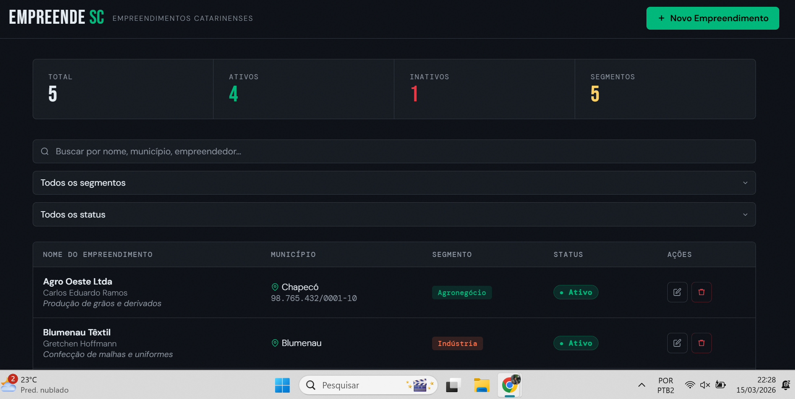
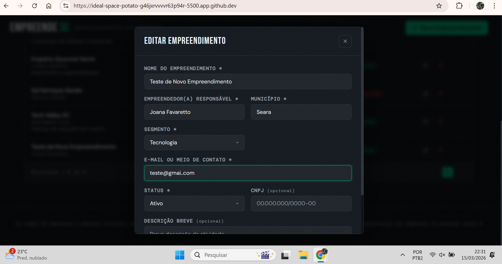
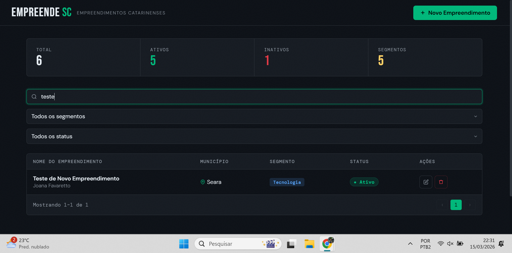
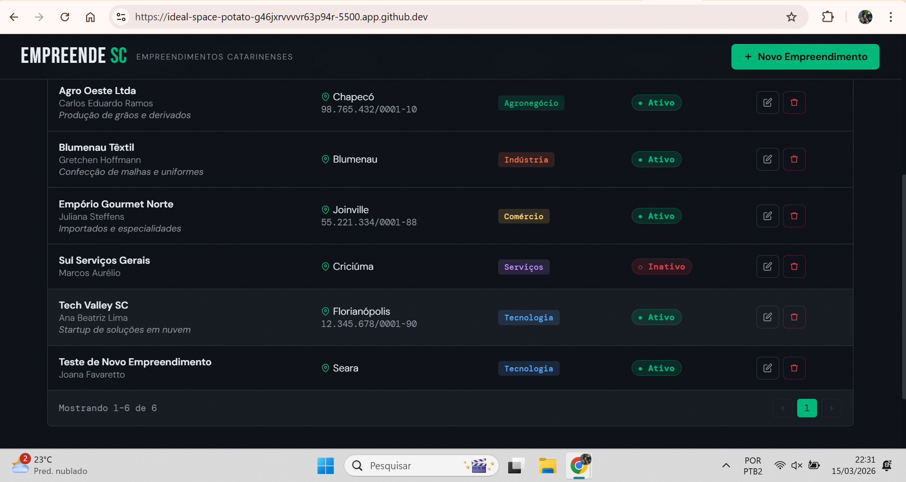
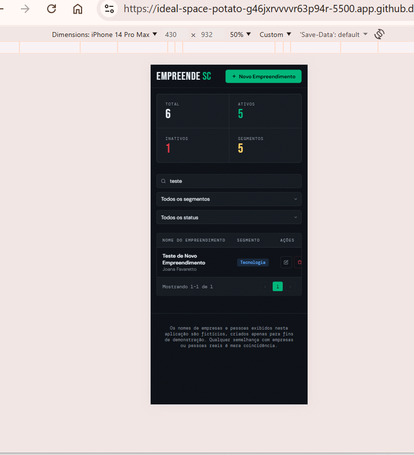

# IA-para-DEVs
Aplicação WEB do tipo CRUD, como forma de inscrição de processo seletivo.
# EmpreendeSC

> Sistema de gerenciamento de empreendimentos catarinenses — CRUD completo em front-end puro.

[](.)
[](.)
[](.)

---

## 🎬 Vídeo Pitch

👉 [Assistir no YouTube](https://www.youtube.com/watch?v=SEU_LINK_AQUI)

---

## 1. Descrição da solução

O **EmpreendeSC** é uma aplicação web front-end de página única (SPA) para cadastro, consulta, edição e remoção de empreendimentos do estado de Santa Catarina.

Desenvolvida com HTML, CSS e JavaScript puros — sem frameworks ou bibliotecas externas — toda a persistência de dados é feita via **localStorage** do navegador, tornando a aplicação totalmente portátil: basta abrir o `index.html` em qualquer navegador moderno.

A interface adota tema escuro, tipografia distintiva (`Bebas Neue` + `DM Sans` + `DM Mono`) e animações CSS sutis, com foco em usabilidade e leitura rápida de dados.

### Funcionalidades implementadas

| Operação | Descrição |
|---|---|
| **Cadastrar** | Formulário em modal com validação de campos obrigatórios e feedback visual de erros |
| **Listar** | Tabela paginada (10 itens/página) com painel de estatísticas em tempo real |
| **Buscar e filtrar** | Busca textual com debounce + filtros por segmento e status |
| **Ordenar** | Colunas clicáveis para ordenação ascendente/descendente |
| **Editar** | Modal reutilizável pré-preenchido para atualização de qualquer registro |
| **Remover** | Exclusão com diálogo de confirmação para evitar remoções acidentais |
| **Persistência** | Dados mantidos no localStorage entre sessões do navegador |
| **Dados de exemplo** | 5 empreendimentos pré-carregados na primeira execução |

### Campos gerenciados

**Obrigatórios:** Nome do empreendimento · Empreendedor(a) responsável · Município · Segmento (Tecnologia, Comércio, Indústria, Serviços ou Agronegócio) · E-mail ou meio de contato · Status (Ativo / Inativo)

**Opcionais:** CNPJ · Descrição breve da atividade

> ⚠️ **Aviso:** Os nomes de empresas e pessoas exibidos nesta aplicação são **fictícios**, criados apenas para fins de demonstração. Qualquer semelhança com empresas ou pessoas reais é mera coincidência.

---

## Screenshots







## 2. Tecnologias utilizadas

| Tecnologia | Finalidade |
|---|---|
| **HTML5** | Estrutura semântica, formulários com `<datalist>` para autocomplete de municípios |
| **CSS3** | Design responsivo, variáveis CSS (`custom properties`), animações e transições |
| **JavaScript ES6+** | Lógica CRUD, filtros, ordenação, paginação, validação e gerenciamento de estado |
| **localStorage API** | Persistência de dados no navegador, sem necessidade de back-end |
| **Google Fonts** | Tipografia: Bebas Neue, DM Sans, DM Mono |

Sem dependências externas de JavaScript.

---

## 3. Estrutura do projeto

```
empreendesc/
│
├── index.html          # Marcação HTML — estrutura e templates dos modais
│
├── css/
│   └── style.css       # Todos os estilos: tokens, componentes, animações, responsividade
│
├── js/
│   ├── storage.js      # Camada de persistência (localStorage) e seed de dados iniciais
│   ├── render.js       # Funções de renderização: tabela, paginação, estatísticas
│   ├── ui.js           # Componentes de interface: toasts, modais, validação de formulário
│   └── app.js          # Controlador principal: estado, filtros, CRUD, inicialização
│
└── README.md           # Documentação do projeto
```

### Separação de responsabilidades

- **`storage.js`** — isola toda a lógica de leitura/escrita no localStorage; funções puras sem efeito colateral na UI
- **`render.js`** — funções que recebem dados e atualizam o DOM (tabela, paginação, stats)
- **`ui.js`** — componentes interativos reutilizáveis (toast, abertura/fechamento de modais, validação)
- **`app.js`** — orquestra o estado da aplicação e conecta as camadas acima

---

## 4. Como executar

### Opção 1 — Abrir diretamente no navegador

```bash
# 1. Clone o repositório
git clone https://github.com/jofavaretto/empreendesc.git 

# 2. Acesse a pasta
cd empreendesc

# 3. Abra no navegador
# macOS
open index.html
# Linux
xdg-open index.html
# Windows: clique duplo em index.html
```

> ⚠️ Alguns navegadores bloqueiam `localStorage` em arquivos `file://`. Se os dados não persistirem, use a Opção 2.

### Opção 2 — Servidor local (recomendado)

**Python (sem instalação adicional):**
```bash
python -m http.server 8080
# Acesse: http://localhost:8080
```

**Node.js com npx:**
```bash
npx serve .
# Acesse: http://localhost:3000
```

**VS Code:** instale a extensão **Live Server** e clique em _"Open with Live Server"_.

### Requisitos

- Navegador moderno com suporte a ES6+ (Chrome 80+, Firefox 75+, Edge 80+, Safari 14+)
- Conexão à internet apenas para carregar as fontes do Google Fonts (fallback sans-serif disponível offline)

---

## Decisões técnicas

**Vanilla JS sem framework**
A escolha por JavaScript puro mantém zero dependências, facilita a leitura do código e elimina a necessidade de processo de build (Node.js, Webpack, Vite etc.). Para o escopo de um protótipo de CRUD, essa abordagem é pragmática e suficiente.

**Arquitetura em módulos separados**
Apesar de ser um projeto pequeno, os arquivos JS foram divididos por responsabilidade (`storage`, `render`, `ui`, `app`) para demonstrar separação de camadas e facilitar manutenção futura.

**localStorage como banco de dados**
Atende perfeitamente ao escopo de um protótipo front-end sem exigir back-end ou autenticação. Os dados persistem entre sessões no mesmo dispositivo/navegador.

**Design dark mode com CSS custom properties**
Todos os valores de cor e tipografia estão centralizados em variáveis CSS em `:root`, facilitando customização e garantindo consistência visual em toda a aplicação.

---

## Licença

Projeto desenvolvido para fins de avaliação no processo seletivo **SCTEC — Trilha IA para DEVs** (SENAI/SC LAB365).

---

## Autor

Desenvolvido por **Joana Favaretto - @jofavaretto**.